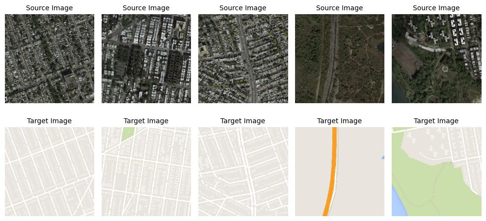
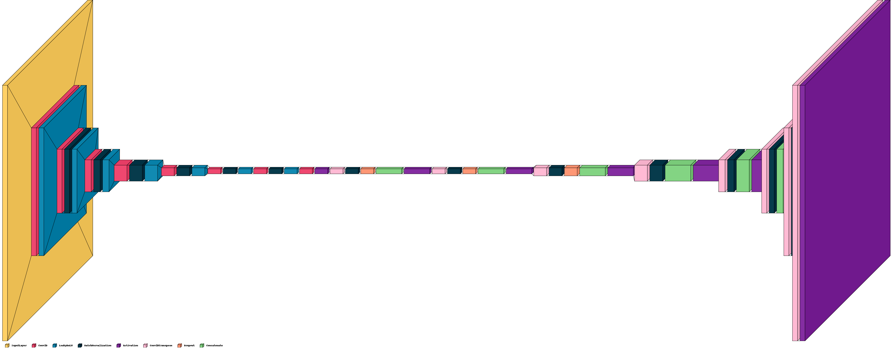
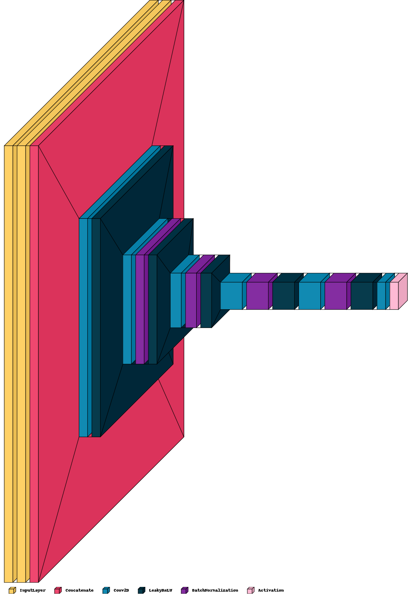

# Satellite to Map Images using Pix2Pix GAN

This project involves converting satellite images to map images using the Pix2Pix GAN architecture. The model is trained to generate map-like outputs from corresponding satellite inputs.

## Dataset

The dataset used for this project can be downloaded from the following link:
- [Dataset Link](http://efrosgans.eecs.berkeley.edu/pix2pix/datasets/maps.tar.gz)

## Example Images

Below are sample images of the source (satellite) and target (map) images used for training the model.

### Source Image (Satellite) and Target Image (Map)

*Note: The images above are bordered for clarity.*

## Model Architecture

### Generator - U-NET Architecture

The generator in this Pix2Pix GAN is based on the U-NET architecture. It consists of an encoder-decoder structure with skip connections to allow the transfer of high-resolution features from the encoder to the decoder. This architecture helps in generating high-quality outputs with finer details.

### Discriminator - PatchGAN

The discriminator is a convolutional neural network based on the PatchGAN architecture. Instead of classifying the entire image as real or fake, it classifies each N x N patch of the image. This allows the model to focus on high-frequency structures in the image, leading to more realistic outputs.

## Loss Function

The loss function used for training the model is Binary Cross-Entropy (BCE) and Mean Absolute Error (MAE)

## Training Process

- The model is trained for 10 epochs.
- The model's weights are saved as a `.h5` file after every 2 epochs to ensure that the training progress is not lost.

## Trained Model

The trained model's `.h5` files can be found in the following folder:
- [Trained Model Folder Link](https://drive.google.com/drive/folders/1CbBApaOQG_bcIyDwTY41yEX8L54q1J_q?usp=sharing)

## Acknowledgments

- The Pix2Pix GAN architecture is based on the paper "Image-to-Image Translation with Conditional Adversarial Networks" by Phillip Isola et al.
- Special thanks to the creators of the dataset used for training.# Satellite-Images-to-Map-Images
# Satellite-Images-to-Map-Images
